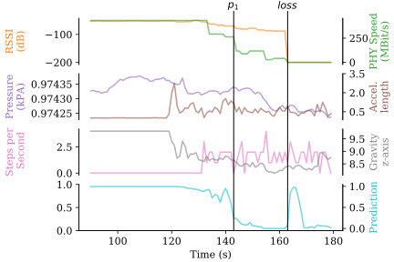
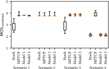
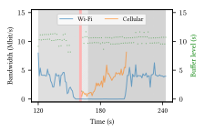
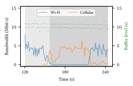

<div class="main-explain-area jumbotron">
  <p style="text-align: justify;">We predict the Wi-Fi connection loss <strong>before</strong> the connection breaks to perform <strong>Seamless Vertical Handovers</strong> between Wi-Fi and cellular networks. Our approach relies on data from <strong>multiple smartphone sensors</strong> like Wi-Fi RSSI, acceleration, compass, step counter or air pressure to predict the connection loss. The app uses <strong>Multipath TCP</strong> to dynamically switch between different wireless connectivity modes.</p>
  <a href="img/hoechst2019learning.pdf">
    <button class="btn btn-success btn-lg get-started-btn" type="submit">Paper PDF</button>
  </a>
  <a href="hoechst2019learning.bib">
    <button class="btn btn-success btn-lg get-started-btn" type="submit">BibTex</button>
  </a>
  <a href="https://github.com/umr-ds/seamcon-SeamlessDemo/releases">
    <button class="btn btn-success btn-lg get-started-btn pull-right" type="submit">Demo App</button>
  </a>

</div>


# Motivation
Smartphones have become our daily mobile companions to provide wireless access to communication, information, and entertainment services.
Since a large amount of data is not downloaded in advance but streamed live via the Internet, seamless connectivity using both Wi-Fi and cellular interfaces is desirable.

The mobility of smartphone users leads to the problem of deciding when to use which wireless connection.
Most smartphones use Wi-Fi as the default interface, since many cellular data plans will be throttled after exceeding a certain limit and therefore should not be used when Wi-Fi is available.
The decision when to perform vertical handovers is often based on the Wi-Fi RSSI and timeouts for the transmission of packets for example as implemented in the Android Wi-Fi State Machine. 
Unfortunately, the mobile operating system detects the connection loss some time after the connection was lost.
Finally, the application needs to reestablish the connection, which can lead to bad Quality of Experiences.

We use various sensor available in nowadays smartphones to predict the Wi-Fi connection loss and switch from Wi-Fi to the cellular network using MPTCP.

<figure class="figure">
  
  <figcaption class="figure-caption text-right"><br />Figure: Overview of some Sensors and the resulting Prediction</figcaption>
</figure>

The above figure shows sensor data and prediction of a run performed for the DASH experiments presented [below](index#results).
The first positive loss prediction $$p_1$$ happens at $$t=143$$, whereas the $$loss$$ event is at $$t=163$$. At a first glance, there is no obvious correlation between the sensor readings and the Wi-Fi loss event. But as will be explained later, such events can be predicted using sensors.

<div style="position: relative; padding-bottom: 56.25%; width: 100%;">
	<iframe style="position: absolute; width: 100%; height: 100%; " src="https://www.youtube.com/embed/E0CFLk82s6s" frameborder="0" allow="accelerometer; encrypted-media; gyroscope; picture-in-picture" allowfullscreen></iframe>
</div>

# Getting Started
We have developed an app, which uses MPTCP and our prediction to establish a second subflow, before the Wi-Fi connection breaks. This is used to improve the Quality of Experience of a sample video, which is also part of the app.
You have two options to get started:

## Install the App
<div class='pull-right' style="width: 20%;" markdown="1">
  
</div>
Installing the app gives you the predictions. If you have a MPTCP kernel installed, the handover will work out of the box. This version uses the video running on our server. Please note, that usage stats are sent to our server.

```
adb install Seamless_Connectivity.apk
```

## Install the Entire Experiment Stack
You can also install the entire experiment stack, starting from your version of the app to the video stream.

**Note: As of writing this article, a MPTCP kernel is only available for the Nexus 5 hammerhead with Android 4.4.2** You will also need a Linux machine (we use Ubuntu 16.04) and a server with a public IP or domain.

Additionally, the Linux development machine needs some Software installed.

```
sudo apt install adb fastboot abootimg android-studio
```

From here on, follow the linked instructions step by step.

1. [Restore stock Android 4.4.2 with root permissions](stock_android)
2. [Build and flash the MPTCP kernel](mptcp_kernel)
3. [Setup Video Stream](video_stream)
4. [Install the Apps](install_apps)

#### Congratulations. Now, you can start experiments.

# Predicting Wi-Fi loss
As already stated, we used ML to predict the Wi-Fi loss event 15 seconds in the future based on the last 60 seconds. We evaluated various ML algorithms and different data sets. Below are some more details about the best functioning combinations. If you want more information, please read the paper.

## Used Sensors
For the classification and prediction, we used a variety of sensors, which are all available on commodity smartphones and can be accessed cheaply from within apps.

* Pressure (delta)
* Absolute Pressure
* Linear Acceleration (all axes separately)
* Linear Acceleration (all three axes together)
* Step Counter
* Power Data (if the phone is charging or not)
* Remaining Battery Capacity
* Gravity (all axes)
* Gyroscope
* Magnetic Field (all axes)
* Absolute Phone Orientation
* Phone Rotation (all axes)
* Wi-Fi Freuency (2.4 GHz or 5 GHz)
* Wi-Fi Speed (IEEE 802.11b, IEEE 802.11n, ...)
* Wi-Fi RSSI

We used an Artificial Neural Network with 5 layers with 400 neurons in each layer. The data was split randomly in 70 percent training data and 30 percent test data.

The results show, that our prediction works very good. A detailed description is shown [in this section.](ml)

```
             precision    recall  f1-score   support    
    no loss       0.99      0.96      0.98     50748
       loss       1.00      1.00      1.00    422865
    
avg / total       0.99      0.99      0.99    473613
```

# Results

## Setup and Reproduction
Besides providing detailed information about the the steps of the paper, we also make all experiment results publicly available.
You can download the [sensor logs and predictions](https://ds.mathematik.uni-marburg.de/seamcon/seamcon_predictions_paper.tar.gz), the [DASH statistics](https://ds.mathematik.uni-marburg.de/seamcon/seamcon_dashsstats_paper.tar.gz) and the [TCP dumps](https://ds.mathematik.uni-marburg.de/seamcon/seamcon_tcpdump_paper.tar.gz).
The Jupyter Notebooks used for analysis can be found [in their own repo.](https://github.com/umr-ds/seamcon-learning-wifi-loss)
We also provide a `Dockerfile`, so you can quickly run the Jupyter Notebooks and reproduce every step done by us.

Download all above linked data and repos. Build the Docker container and fire it up. Please provide the right parameters in the commands below.

```
docker build .
docker run -p=8888:8888 -v <PATH_TO_DOWNLOADED_FILES>:/jupyter <IMAGE_ID>
```

The output of the container will contain a URL (similar to `http://0.0.0.0:8888/?token=9b7e8f0aaec254f72bbed67074deae7bab1ceb6e8473e917`). Open the URL in your browser.

Here you will find a `main.ipynb` notebook, which encapsulates all steps required to reproduce the ML and evaluation of the experiment results. The learing will also yield the models for the App, which you can use for your own experiments. If you want to do this, replace the `data.json` and `MLPClassifier.java` files in the App with the ones you want to use from the `learners` directory.

You also can use the `main.ipynb` notebook to learn and evaluate your own experiments. Just include your files into the Docker container.

## Evaluation
Our evaluation shows, that we can improve the Quality of Experience for users significantly, as can be seen in the figure below.

<figure class="figure">
  
  <figcaption class="figure-caption text-right"><br />Figure: Quality of Experience Mean Opinion Score Comparison (higher is better)</figcaption>
</figure>

The following bandwidth figures show clearly that our approach ommits the gap between losing Wi-Fi and establishing a LTE connection. The left figure shows Stock Android, where a gap at around second 170 occurs, resulting in a video stalling as shown in the red background. The left figure clearly avoids these situations.

<div class="container" style="width: 100%;">
  <div class="theme-table-image col-sm-6">
    <figure class="figure">
      
      <figcaption class="figure-caption text-left">Figure: Bandwidth, Bufferlevel and Quality for Stock Android</figcaption>
    </figure>
  </div>

  <div class="theme-table-image col-sm-6">
    <figure class="figure">
      
      <figcaption class="figure-caption text-right">Figure: Bandwidth, Bufferlevel and Quality using our approach</figcaption>
    </figure>
  </div>
</div>

### That's it. Enjoy the better user experience we provide with our Wi-Fi loss prediction approach.